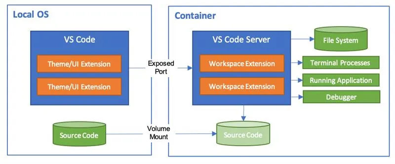
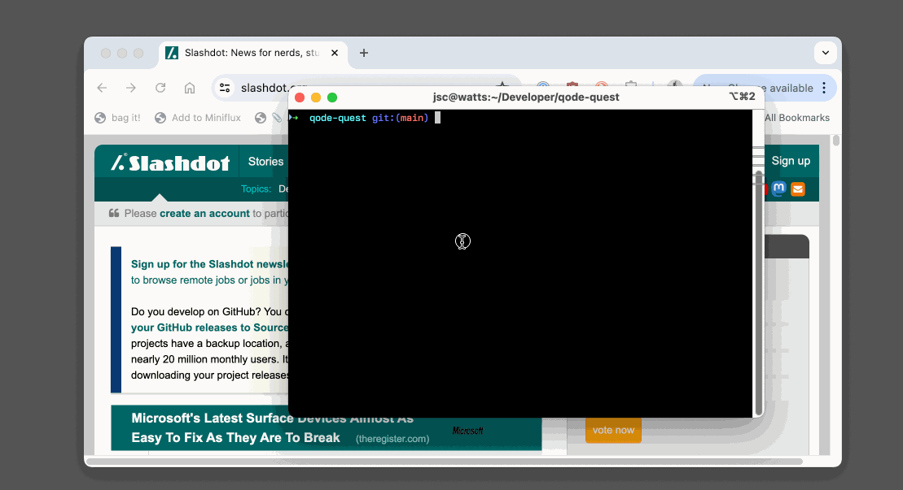
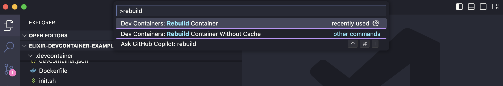
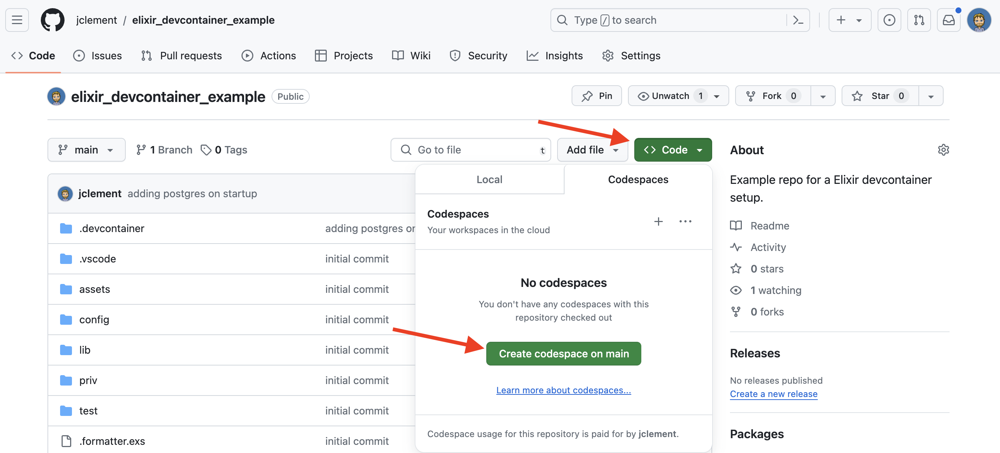
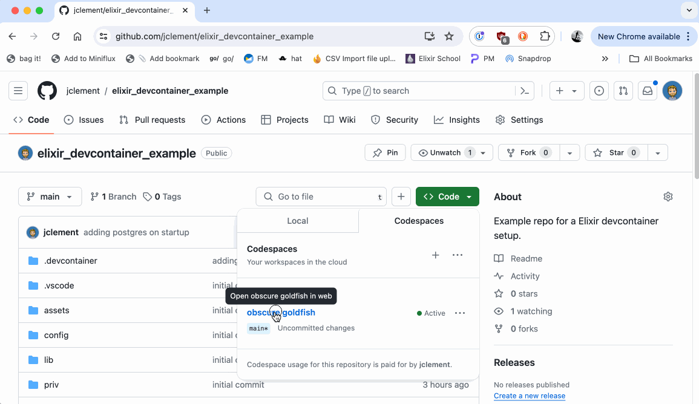
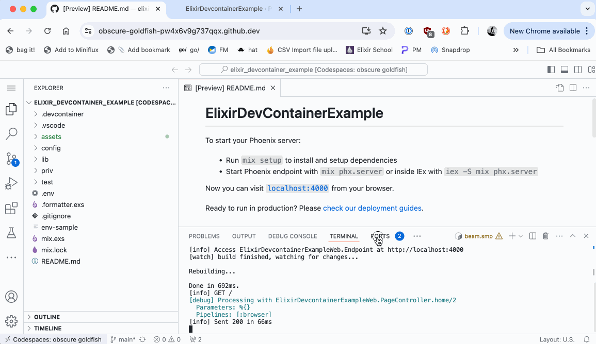

# Why I ❤️ DevContainers
<!-- class: invert -->


---
<!-- class: normal -->
<!-- footer: " " -->
# Problems

> These problems are especially bad for **hobby** projects!
 
1. Development machines tend to collect too many tools over time.
2. Project dependencies can conflict with each other.
3. Opening *old* projects tends to go badly.
4. Dealing with inconsistencies in dependencies/tooling on multi-dev projects.

---
# What is a *Container*?

> A container (Docker) is a lightweight, standalone executable package that **includes everything needed to run a piece of software**: code, runtime, system tools, libraries, and settings. It allows you to install and run software in an **isolated environment**, ensuring consistent performance across different environments without the overhead of a full virtual machine.

Docker is a very common container environment but there are others such as LXC, Kubernetes, Podman, ...

<!--
Imagine you have a magical lunchbox. This lunchbox can hold all your favorite foods, no matter how messy or different they are. It keeps everything inside neatly separated, so the ice cream doesn't mix with the spaghetti.

Now, think of software as different foods. Sometimes, when you put all your software on one computer, they can get messy and cause problems, just like mixing ice cream and spaghetti.

A container is like that magical lunchbox for software. It lets you pack all the parts of your software (the programs, tools, and settings) into one neat package. This package can be opened on any computer, and everything inside will work perfectly without getting mixed up with other software.

Even better, using a container doesn't require a whole extra kitchen (like a virtual machine does). It's lightweight, like carrying just a lunchbox instead of a whole kitchen. So, you can run your software in an isolated environment without the heavy load of a full virtual machine.
-->

---

# What is a *DevContainer*?

> A devcontainer is a pre-configured development environment that uses container technology to provide a **consistent, isolated, and reproducible workspace for developers**. It includes all the necessary tools, dependencies, and settings needed to work on a project, ensuring that the development setup remains the same across different systems.

---

# How VSCode handles DevContainers...


* Source code exists on your local machine
* All the code runs in the container
* Container specific Extensions!
 
---
<!--
# Why I ❤️ DevContainers

- I dabble in many fun side projects, in many languages, with many toolkits
- My computers become a 🗑️🔥 fire of development tools over time
- Opening old projects is often frustrating (dependencies no longer there)

DevContainers make my life **much** better:

1. I can define (per project) exactly the environment that project needs (i.e. Elixir 1.17 + Erlang/OTP 27 + Postgres).
2. I can work on that project in a *container* keeping those dependencies off my bare machine.
3. I can open that project a year later and it'll still work, despite whatever upgrades / changes have happened on my machine

---
-->

<!-- class: invert -->



---

<!-- class: normal -->
# What's required to use a DevContainer?

1. Docker (*can technically be on a remote host*)
2. Editor with support for DevContainers:
   1. [Visual Studio Code](https://marketplace.visualstudio.com/items?itemName=ms-vscode-remote.remote-containers)
   2. [NeoVim](https://github.com/esensar/nvim-dev-container) - I've never tried this
   3. [Github Codespaces](https://github.com/features/codespaces) - Work right from your browser (zero local footprint) - $$
   4. [Jetbrains.*](https://plugins.jetbrains.com/plugin/21962-dev-containers)
3. `.devcontainer` configuration in the project root

---

# DevContainers in VSCode is kind of a **big deal**


---

# A basic `.devcontainer/devcontainer.json`

```json
{
  "name": "Python 3",
  "image": "mcr.microsoft.com/devcontainers/python:1-3.12",

  // Features to add to the dev container. More info: https://containers.dev/features.
  "features": {
    "ghcr.io/devcontainers-contrib/features/postgres-asdf:1": "1.0.2",
  },

  // Install some Configure tool-specific properties.
  "customizations": {
    "vscode": {
      "settings": {},
      "extensions": [
        "streetsidesoftware.code-spell-checker",
        "ms-python.python"
      ]
    }
  },
  
  // Use 'forwardPorts' to make a list of ports inside the container available locally.
  "forwardPorts": [9000],

  // Use 'postCreateCommand' to run commands after the container is created.
  "postCreateCommand": "pip3 install -r requirements.txt"

}
```

--- 

<!-- class: invert -->
# But what if I need something special?
## Customizing a container with `Docker` to get what we want

---

<!-- class: normal -->
# What is a `Dockerfile`?

> A Dockerfile is a text document that contains a series of instructions on how to build a Docker image. Each instruction in the Dockerfile creates a layer in the image, starting from a base image, and adds software, copies files, sets environment variables, and defines commands to run. 

---

<!-- class: normal -->
# Updated `devcontainer.json` (using a Dockerfile)

```json
{
  "name": "My DevContainer",
  "build": {"dockerfile": "Dockerfile"},

  // Command to run after dev container *created*.  
  "postCreateCommand": ". .devcontainer/post_create.sh",

  "forwardPorts": [4000, 5432],

  "customizations": {
    "vscode": {
      "extensions": [
        "phoenixframework.phoenix",
        "JakeBecker.elixir-ls",
      ]
    }
  }
}
```

---

# The special `.devcontainer/Dockerfile`

```docker
FROM mcr.microsoft.com/devcontainers/base:jammy

ARG ELIXIR_VERSION=1.17.1
ARG ERLANG_VERSION=27.0
ARG ASDF_VERSION=0.13.1

# Get this thing up-to-date
RUN apt-get update \
  && apt-get upgrade -y \
  && apt-get install -y git curl inotify-tools wget imagemagick \
     build-essential autoconf m4 libncurses5-dev libwxgtk3.0-gtk3-dev \ 
     libwxgtk-webview3.0-gtk3-dev libgl1-mesa-dev libglu1-mesa-dev \ 
     libpng-dev libssh-dev unixodbc-dev xsltproc fop libxml2-utils \
     libncurses-dev openjdk-11-jdk

# Install ASDF
RUN git clone https://github.com/asdf-vm/asdf.git /opt/asdf --branch v${ASDF_VERSION}

# install Elixir and Erlang
RUN sh -c 'echo "source /opt/asdf/asdf.sh" >> /home/vscode/.bashrc'
RUN sudo -u vscode bash -c 'source /opt/asdf/asdf.sh && asdf plugin-add erlang https://github.com/asdf-vm/asdf-erlang.git'
RUN sudo -u vscode bash -c "source /opt/asdf/asdf.sh && asdf install erlang $ERLANG_VERSION && asdf global erlang $ERLANG_VERSION"
RUN sudo -u vscode bash -c 'source /opt/asdf/asdf.sh && asdf plugin-add elixir https://github.com/asdf-vm/asdf-elixir.git'
RUN sudo -u vscode bash -c "source /opt/asdf/asdf.sh && asdf install elixir $ELIXIR_VERSION && asdf global elixir $ELIXIR_VERSION"

# locale
ENV LANG en_US.UTF-8
ENV LC_ALL en_US.UTF-8
ENV LANGUAGE en_US:en

CMD ["/bin/bash"]
```


---

# Doing some setup steps on container creation

```json
{
  "name": "My DevContainer",
  ...

  // Command to run after dev container *created*.  
  "postCreateCommand": ". .devcontainer/post_create.sh",

  ...
}
```

My `.devcontainer/post_create.sh` script:

```sh
cd assets && yarn install && cd ..
mix setup
```

---

# Rebuilding your Container

Visual Studio usually offers to rebuild when your configuration changes.  You can also do it manually.



---


<!-- class: invert -->
# But what if I need other services?
## <cough>**A database**</cough>

---

<!-- class: normal -->
# Adding more services

1. Use `docker-compose` 
   *Not really supported by Github Codespaces.*
2. Host those services outside of your container
   *Defeats the self-containedness benefits of the container.*
3. Add services to your container & `Dockerfile` 👈👈
   *Need to rely on DevContainer life-cycle hook to start.*

---

# Adding **postgres** to my `Dockerfile`

```docker
...

ENV PGUSER=postgres
ENV PGHOST=127.0.0.1
RUN sudo sh -c 'echo "deb https://apt.postgresql.org/pub/repos/apt $(lsb_release -cs)-pgdg main" \
  > /etc/apt/sources.list.d/pgdg.list'
RUN curl -fsSL https://www.postgresql.org/media/keys/ACCC4CF8.asc \ 
  |sudo gpg --dearmor -o /etc/apt/trusted.gpg.d/postgresql.gpg
RUN apt update
RUN apt install -y postgresql-16
# Postgres from anywhere!
RUN sh -c 'echo "host all all all trust" > /etc/postgresql/16/main/pg_hba.conf'

...
```

Instruct VSCode to start postgres after our container starts (in `devcontainer.json`):
```json
...
	// Command to run after the dev container starts.
	"postStartCommand": "sudo service postgresql start",
...
```

---

<!-- class: invert -->

# Codespaces?
## Your development container in the cloud!

---

<!-- class: normal -->

# Creating a Codespace (**charges apply**)



---




---



---

<!-- class: invert -->


# **TL;DR;** Why I ❤️ DevContainers

* I can experiment with new tools without trashing my development machine.
* I don't end up with dependency conflicts between different projects.
* I spend less time trying to fix old projects that no longer run on my computer.
* I can easily onboard someone else into my project.  No need to follow a monster "README.MD" with 200 installation steps.
* I *somewhat* reduce the risk of a malicious development tool (or code base) doing bad things to my entire computer.

---

<!-- class: normal -->

# Resources
- 👉 My Full Elixir/Phoenix Sample Project 
  https://github.com/jclement/elixir_devcontainer_example
- VSCode DevContainer Docs
  https://code.visualstudio.com/docs/devcontainers/containers
- Available DevContainer Features (addons for your containers)
  https://containers.dev/feature
- DevContainer Life-cycle Scripts (init/startup for your containers)
  https://containers.dev/implementors/json_reference/#lifecycle-scripts